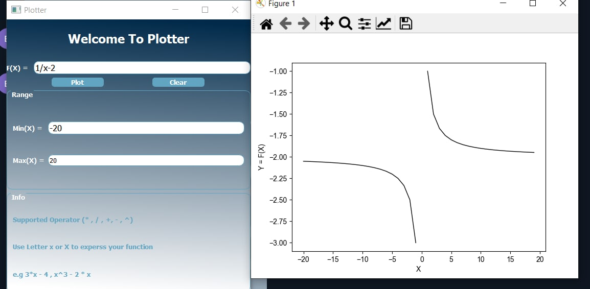

# Function-Plotter

<h3>Build With : </h3>
 <ul>
  <li><a href="https://www.python.org/">Python</a></li>
  <li><a href="https://build-system.fman.io/pyqt5-tutorial">PyQt5</a></li>
  <li><a href="https://docs.python.org/3/library/unittest.html">unittest</a></li>
  <li><a href="https://matplotlib.org/">matplotlib</a></li>
 </ul>

   
   
<h3>Getting Started</h3>
<blockquote>
  
This is an list of needed instructions to set up your project locally, to get a local copy up and running follow these instructuins.
 

</blockquote>
<h3 href="#installation">Installation</h3>
<ol>
  <li><strong><em>Clone the repository</em></strong>
    <blockquote>$ git clone https://github.com/Waer1/Plotter</blockquote>
  </li>
  <li> 
  <strong><em>Navigate to repository directory
</em></strong>
    <blockquote>$ cd Plotter/Plotter</blockquote>
  </li>
  <li> 
  <strong><em>Install dependencies
</em></strong>
    <blockquote>$ python -m pip install -U matplotlib</blockquote>
 <blockquote>$ pip install PyQt5</blockquote>
  </li>
</ol>
<h3 href="#Running">Running</h3>
<ol>
  <li><strong><em>Run the Function Plotter </em></strong>
       <blockquote>$python Plotter.py </blockquote>
  </li>
    <li><strong><em>Running unit tests </em></strong>
    <blockquote>$python test.py
</blockquote>
  </li>
 
</ol>

<h2 href="#structure">File Structure</h2>
 
 
  <pre>
Function-Plotter1
├── README.md
├── Plotter.py
├── Plooter.ui
├── Valdiation.py
├── ShowErrors.py
├── Plot.py
├── SnapShots
├── test.py
  </pre>

<h2 href="#screenshots">ScreenShots</h2>
<ol>
<li>
  <h4>Empty Expression</h4>
  
 </li>

 <li>
  <h4>Invalid Expression Validations</h4>
  
 </li>
 <li>
  <h4>Max&Min Fields Validations</h4>
  
  
  
 </li>
 
 <li> 
 <h4>Plotting Function Result</h4> 
  
 </li>
</ol>

